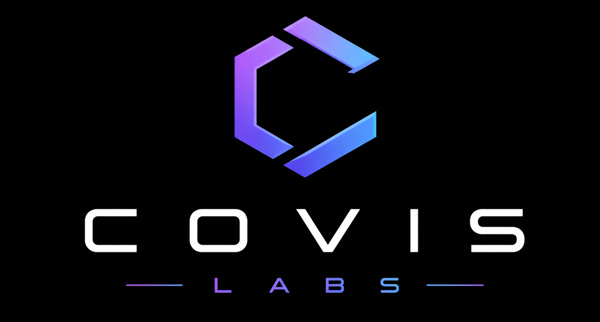

  

<h1 align="center">COVIS Labs</h1>

Building modern software, intelligent systems, digital infrastructure, and future-facing ventures.

  <a href="https://covislabs.com">🌐</a>
  &nbsp;&nbsp;
  
  &nbsp;&nbsp;
  
  &nbsp;&nbsp;
  
  &nbsp;&nbsp;
  
  &nbsp;&nbsp;
  
  &nbsp;&nbsp;
  
  &nbsp;&nbsp;
  <a href="mailto:hello@covislabs.com">✉️</a>

---

## About

COVIS Labs is a modern holding company and innovation studio focused on building high-leverage digital products, intelligent systems, and scalable ventures.

We operate across multiple domains under one unified vision:

- Software Products  
- Artificial Intelligence  
- Cyber & Digital Security  
- Internet Platforms  
- Automation Systems  
- Internal Tools  
- Experimental Ventures  
- Long-Term Technology Bets  

Our model is simple:

> Build exceptional.  
> Launch meaningful.  
> Create durable.

---

## What We Do

### Software Engineering

We design and ship modern software with a focus on quality, speed, and usability.

- SaaS Platforms  
- Web Applications  
- Mobile Products  
- Internal Systems  
- APIs & Infrastructure

---

### Artificial Intelligence

We integrate modern AI into real-world products and workflows.

- AI Agents  
- Automation Pipelines  
- Language Systems  
- Recommendation Systems  
- Applied Intelligence Tools

---

### Cyber & Infrastructure

We explore secure, scalable, resilient systems for the modern internet.

- Secure Platforms  
- Identity Systems  
- Infrastructure Tooling  
- Reliability Engineering  
- Operational Security

---

### Venture Studio

We launch, incubate, and scale new ideas internally.

- New Products  
- Spinout Brands  
- Growth Experiments  
- Digital Acquisitions  
- Long-Term R&D

---

## Philosophy

We believe the future belongs to teams who can:

- Build quickly  
- Operate intelligently  
- Design beautifully  
- Think long-term  
- Execute repeatedly

We favor simplicity, leverage, and substance over noise.

---

## Current Focus

- AI-native software  
- Workflow automation  
- Global digital products  
- Growth systems  
- Scalable media assets  
- Internet-first businesses

---

## Open to Collaborate

We are open to working with:

- Founders  
- Operators  
- Designers  
- Engineers  
- Strategic Partners  
- Investors  
- Exceptional Talent

---

## Connect

- Website: https://covislabs.com
- Email: hello@covislabs.com
- Instagram: https://www.instagram.com/covislabs/
- X: https://x.com/covislabs
- LinkedIn: https://linkedin.com/company/covislabs

---

## Motto

> Build what matters.  
> Scale what works.  
> Own the future.

---

© COVIS Labs

